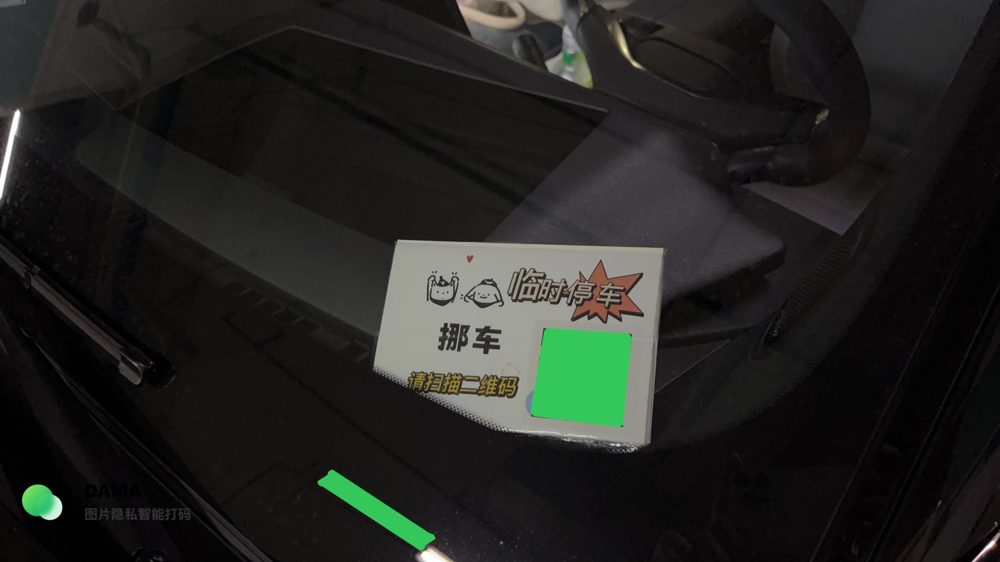

# MoveCar - 挪车通知系统

**Docker 版** | 基于 Node.js 的智能挪车通知系统，扫码即可通知车主，保护双方隐私。



## 为什么需要它？

- 🚗 **被堵车却找不到车主** - 干着急没办法
- 📱 **传统挪车码暴露电话** - 隐私泄露、骚扰电话不断
- 😈 **恶意扫码骚扰** - 有人故意反复扫码打扰
- 🤔 **路人好奇扫码** - 并不需要挪车却触发通知

## 这个系统如何解决？

- ✅ **不暴露电话号码** - 通过推送通知联系，保护隐私
- ✅ **双向位置共享** - 车主可确认请求者确实在车旁
- ✅ **无位置延迟 30 秒** - 降低恶意骚扰的动力
- ✅ **Docker 一键部署** - 轻松部署在任何支持 Docker 的服务器上
- ✅ **数据私有化** - 所有数据存储在本地，安全可控

## 配置教程

### 方式一：使用 Docker Compose 部署（推荐）

1. 创建一个目录并进入：
   ```bash
   mkdir movecar && cd movecar
   ```

2. 创建 `docker-compose.yml` 文件：
   ```yaml
   version: '3'

   services:
     movecar:
       # 使用官方最新镜像
       image: ghcr.io/a-xizaoqin/movecar:main
       container_name: movecar
       ports:
         - "3000:3000"
       volumes:
         # 数据持久化，防止重启丢失状态
         - ./data:/app/data
       environment:
         # 必填：你的 Bark 推送地址 (例如 https://api.day.app/你的Key)
         - BARK_URL=https://api.day.app/xxxxxxxxxxxx
         # 选填：备用联系电话 (显示在成功页面)
         - PHONE_NUMBER=
       restart: unless-stopped
   ```

3. 启动服务：
   ```bash
   docker-compose up -d
   ```

4. 访问 `http://你的服务器IP:3000` 即可看到挪车页面。

### 方式二：手动构建部署

如果你想修改代码后自行构建：

```bash
git clone https://github.com/A-xizaoqin/movecar.git
cd movecar
docker-compose up -d --build
```

## 制作挪车码

### 生成二维码

1. 部署完成后，你的访问地址是 `http://你的IP:3000`（如果有域名，建议配置反向代理开启 HTTPS）。
2. 使用任意二维码生成工具（如 草料二维码）将你的地址生成二维码。
3. 打印出来贴在车上即可。

## 使用流程

### 请求者（需要挪车的人）

1. 扫描车上的二维码，进入通知页面
2. 填写留言（可选），如「挡住出口了」
3. 允许获取位置（不允许则延迟 30 秒发送）
4. 点击「通知车主」
5. 等待车主确认，可查看车主位置

### 车主

1. 收到 Bark 推送通知
2. 点击通知进入确认页面
3. 查看请求者位置（判断是否真的在车旁）
4. 点击确认，分享自己位置给对方

## License

MIT
